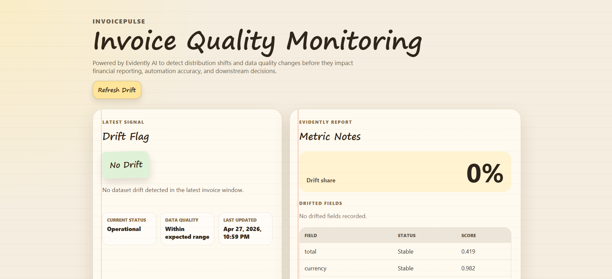

# InvoicePulse

InvoicePulse is an invoice quality monitoring platform for teams that rely on
automated extraction pipelines and need confidence in downstream finance
operations.

It continuously surfaces distribution changes and quality risks with
Evidently AI, presents a clear executive-ready dashboard, and helps teams detect
degradation early before it impacts reporting, reconciliation, or automation
workflows.

Because the upstream invoice extraction is LLM-based, output behavior can shift
as vendor patterns, document formats, language usage, and prompt/model dynamics
change over time. Drift monitoring is therefore essential to maintain extraction
accuracy, reduce silent failures, and preserve trust in financial automation.



## Product Highlights

- Drift monitoring powered by Evidently AI for invoice extraction outputs.
- Built for LLM-driven invoice extraction pipelines where model behavior can drift in production.
- Supabase-native architecture for data, storage, and report persistence.
- Executive-ready React dashboard focused on risk visibility and decision support.
- On-demand drift execution from the UI (`Refresh Drift`) for controlled runs.
- Historical run tracking for auditability and trend analysis.

## Tech Stack

- Frontend: React, TypeScript, Vite, TanStack Query
- Backend API: FastAPI, Pydantic
- Drift Engine: Python, Evidently AI, Pandas
- Data Platform: Supabase Postgres + Supabase Storage
- Testing: Pytest, Vitest, Testing Library

## Architecture

- `frontend/` - Monitoring dashboard UI and API integration layer.
- `backend/api/` - FastAPI endpoints for drift status, history, and manual run.
- `backend/python/drift_service/` - Drift computation, schema mapping, and loaders.
- `supabase/migrations/` - Database migrations for extraction and drift reports.
- `docs/` - Runbooks and operational guides.

## Quick Start (Step-by-Step)

### 1) Prerequisites

- Python 3.11+
- Node.js 18+
- npm
- Supabase project with required tables/buckets

### 2) Clone and configure environment

```bash
git clone <your-repo-url>
cd InvoicePulse
```

Create/update `.env` at repository root:

```bash
SUPABASE_URL=...
SUPABASE_SERVICE_ROLE_KEY=...
VITE_API_BASE_URL=http://localhost:8000
```

### 3) Create Python virtual environment

```bash
python -m venv .venv
```

Activate:

- PowerShell: `.\.venv\Scripts\Activate.ps1`
- macOS/Linux: `source .venv/bin/activate`

### 4) Install backend dependencies

```bash
python -m pip install -e ./backend/api
```

Install drift service dependencies:

```bash
cd backend/python/drift_service
python -m pip install -e ".[test]"
cd ../../..
```

### 5) Start backend API

```bash
set PYTHONPATH=backend/python/drift_service/src;.
uvicorn backend.api.main:app --reload
```

For PowerShell:

```powershell
$env:PYTHONPATH="backend/python/drift_service/src;."
uvicorn backend.api.main:app --reload
```

API health check: `http://localhost:8000/health`

### 6) Start frontend

```bash
cd frontend
npm install
npm run dev
```

Open `http://localhost:5173`.

### 7) Run drift analysis from the dashboard

- Click `Refresh Drift` in the dashboard header.
- The app triggers a backend drift run and refreshes latest/historical results.

## Optional: Load sample invoice records

You can ingest test records from the Hugging Face invoice dataset:

```bash
set PYTHONPATH=backend/python/drift_service/src
python -m drift_service.test_dataset_loader --sample-size 300 --seed 42
```

## Scripts and Endpoints

- API:
  - `GET /api/drift/latest`
  - `GET /api/drift/history`
  - `POST /api/drift/run`
- Python:
  - `python -m drift_service.run_once`
  - `python -m drift_service.test_dataset_loader --sample-size 300 --seed 42`
- Frontend:
  - `npm run dev`
  - `npm run build`
  - `npm run test`

## Additional Docs

- `docs/drift-dashboard-runbook.md`
- `docs/hf-dataset-ingestion.md`
